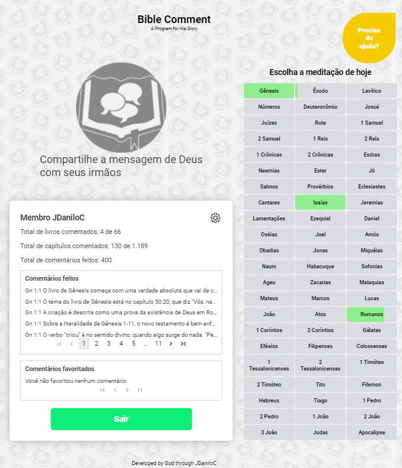
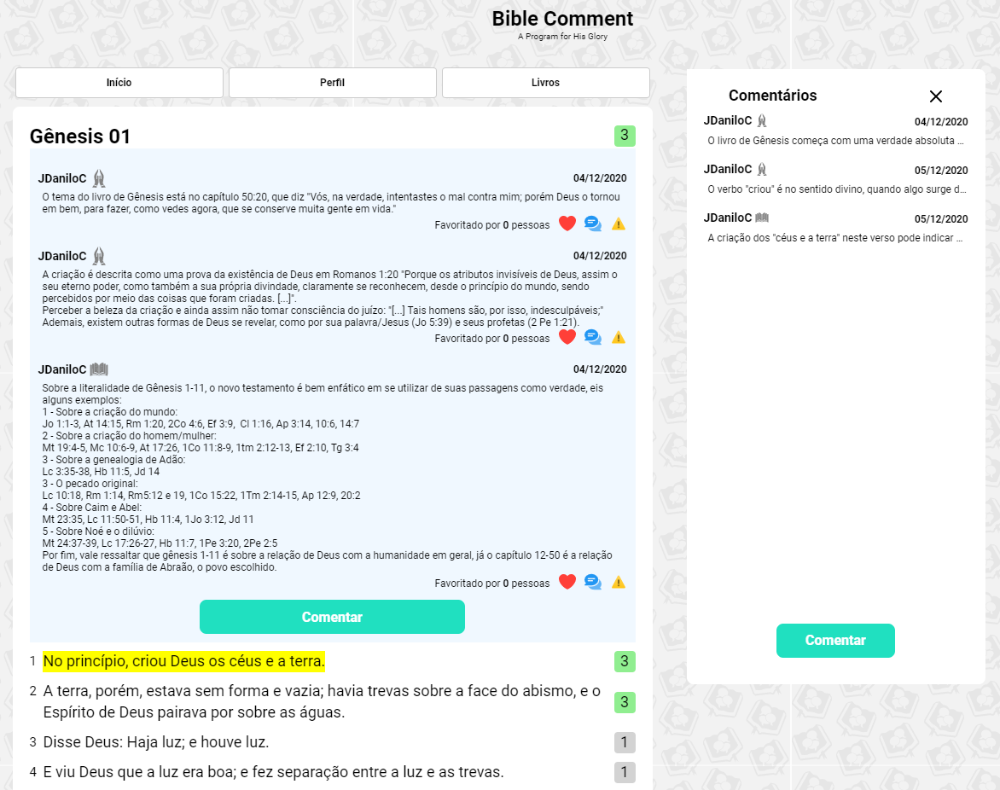

<p align="center">
  
</p>

> A web site to read and share comments about bible versicles.
> Over +500 comments in +150 chapters.

<p align = "center">
  
  
  </br>
  
  
</p>

<p align="center">
  
</p>

## Motivation

I usually make notes in the bible in order to remember important aspects for understanding the text. With free time due to the pandemic of 2020, starting a comment in another bible and wanting to use the weekend hours in a useful way, the biblecomment was born, with the objective of sharing interpretations of the bible and answering difficult verses in an accessible and intuitive way.

## Webscrapping using Python

To capture the bible chapters in ARA version, was used Selenium and [BibleAPI](https://bibleapi.co/) to make a script that returns a json file with the versicles from [biblia.com.br](http://biblia.com.br/).

### How to use

First, you need to install the requirements (selenium and requests).

```bash
cd scrapy
pip install -r requirements
```

You need a token from the [BibleAPI](https://bibleapi.co/) to get more than _20 requests/hour/ip_, because this requests returns how much versicles it's necessary to capture for each chapter. Fill the _token_ variable at [webscraping.py](scrapy/webscraping.py), and write the books to capture in the _book_list_ variable, in the same file.

```py
token = "YOUR TOKEN HERE"

book_list = []
```

This script captures all chapters of the chosen books and save json files in the chapters folder, adding the chapter amount in the book.json file.

Lastly, the [reader.py](scrapy/reader.py) file is to read the json file produced by this process, and the [populatedb.py](scrapy/populatedb.py) is used to populate the database with the data from chapters folder. It's necessary to fill the _baseurl_ variable.

```py
baseurl = "http://localhost:3333"
```



## The backend server

It's required the npm to install yarn. To init the express server, enter in the backend folder, and run this command to install the node modules:

```bash
cd frontend
npm install yarn
yarn install
```

Finally run this command to start the development server

```bash
yarn dev
```

## The web site

It's required the npm to install yarn. To init the react, enter in the frontend folder, and run this command to install the node modules:

```bash
cd frontend
npm install yarn
yarn install
```

In the same directory you can run the developer server using:

```bash
yarn start
```

---

A Program ~~Violin~~ for His Glory ~ Jennifer Jeon <3
